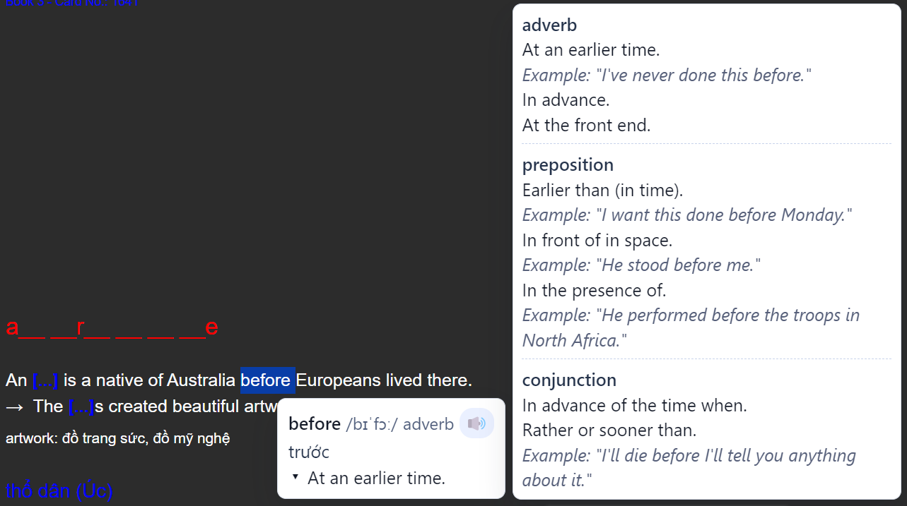

# Popup Lookup - Definition & Translation (Anki Add-on)



Add-on tra cứu từ và dịch nhanh trong Anki Desktop bằng popover khi bạn bôi đen 1 từ hoặc 1 đoạn văn bản.

## Mục tiêu

- Tra cứu từ điển tiếng Anh ngay trên card.
- Dịch nhanh đoạn văn (EN -> VI mặc định).
- Phát âm từ bằng biểu tượng audio.
- UI popover/subpanel tối ưu để đọc nhanh trong quá trình học.

## Tính năng chính

- Lookup 1 từ: hiển thị word, phiên âm, audio, part-of-speech, definitions, examples.
- Translate 1 đoạn: dịch online qua API.
- Sub panel hiển thị chi tiết meanings và definitions, có phân tách để dễ phân biệt.
- CSS đã được scope/reset để giảm ảnh hưởng global style từ Anki.

## Yêu cầu

- Anki Desktop (không hỗ trợ chạy add-on trên AnkiWeb).
- Python 3 (để chạy script dev/build).
- Kết nối internet cho dictionary API và translation API.

## Cài đặt local (developer)

1. Clone repo vào máy.
2. Chạy deploy local vào thư mục add-on của Anki:

```bash
python scripts/deploy_to_anki.py
```

Script sẽ copy source vào `addons21`, restart Anki nếu đang mở.

## Cấu hình

File cấu hình chính: `config.json`

Các khóa quan trọng:

- `source_language`: ngôn ngữ nguồn (mặc định `en`)
- `target_language`: ngôn ngữ đích (mặc định `vi`)
- `show_example`: hiện/ẩn ví dụ trong definitions
- `max_definitions`: giới hạn số definition mỗi meaning
- `enable_lookup`, `enable_translate`, `enable_audio`: bật/tắt tính năng runtime

## Kiến trúc thư mục

- `__init__.py`: entrypoint Anki hooks + JS bridge.
- `features/lookup/`: xử lý lookup flow.
- `features/translate/`: xử lý translate flow.
- `services/dictionary_api.py`: gọi dictionary API.
- `services/translation_service.py`: gọi translation API (online).
- `web/popup.js`, `web/popup.css`: giao diện và tương tác popover.
- `scripts/deploy_to_anki.py`: deploy local vào Anki.
- `scripts/build_release.py`: đóng gói release artifacts.

## Build release artifacts

Từ root repo:

```bash
python scripts/build_release.py
```

Mặc định sinh 2 file trong `dist/`:

- `anki_popup_lookup.zip`
- `anki_popup_lookup.ankiaddon`

Nếu cần version suffix:

```bash
python scripts/build_release.py --version 1.2.0
```

## Publish lên GitHub Releases tự động

Repo đã có workflow:

- `.github/workflows/release-addon.yml`

Cách dùng:

1. Push code.
2. Tạo tag release:

```bash
git tag v1.2.0
git push origin v1.2.0
```

3. GitHub Actions sẽ tự động build và upload 2 artifacts vào tab Releases.

## Chia sẻ cho người dùng Anki

- Upload artifact lên AnkiWeb Shared Add-ons để nhận add-on code.
- Người dùng Anki Desktop cài bằng:
  - `Tools -> Add-ons -> Get Add-ons...`
  - Nhập code add-on.

## Ghi chú

- Add-on không chạy trực tiếp trên website AnkiWeb.
- Nếu chạy script từ thư mục `scripts/`, dùng lệnh:

```bash
python build_release.py
```

Nếu chạy từ root repo, dùng:

```bash
python scripts/build_release.py
```
